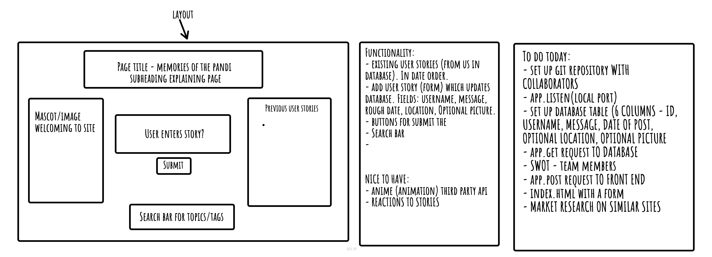

# Memories-of-the-Pandi

Group project: Max, Abel, Kelly , Salima.
Project Name: Memories of the Pandi
Render link: https://memoriesofthepandiclient.onrender.com/

Team members:
Max, Abel, Kelly , Salima.

Project description:
The aim of the app was to build a safe space where people could share their light hearted reflections on the unique circumstances of the pandemic. We wanted people to fill in a form to share their memories, including details of the memory and a picture/location if they wanted to, and for this to appear on the screen in a message board style. We used a panda to represent a cute mascot for the site and as a play on words of the pandemic.

Wireframe:
Picture of wireframe below.

User stories and problem domain:
As a user, I am eager to share my unique pandemic experience on the website, hoping to contribute to the collective narrative. I look forward to accessing all the available tools on the web page to effortlessly post my personal story. Additionally, I am excited about the opportunity to explore and read the diverse range of stories shared by previous users, which I understand are stored in the website's database. This not only allows me to engage with the community but also provides a platform for me to reflect on the shared experiences of others during this significant period. Overall, I anticipate a meaningful and interactive experience on the website, connecting with a broader community through the stories we've all lived through.

Instructions that the user may need to follow in order to get your application up and running on their own computer:
To get our app to work it should be a case of it being up and running out of the box.

Lighthouse report (optional):
Screenshot of the Lighthouse report

References:
We had a lot of references throughout which fed in to the design of our project. These can be seen below:

Inspiration:
We researched various similar apps/websites to get an idea on how to structure/layout our project. The main ones we drew inspiration from were: https://isawyou.com/, https://www.tumblr.com/, https://theunsentproject.net/ and https://www.reddit.com/.

Libraries:
anime.js - to assist in animating parts of the app and bring it to life.
